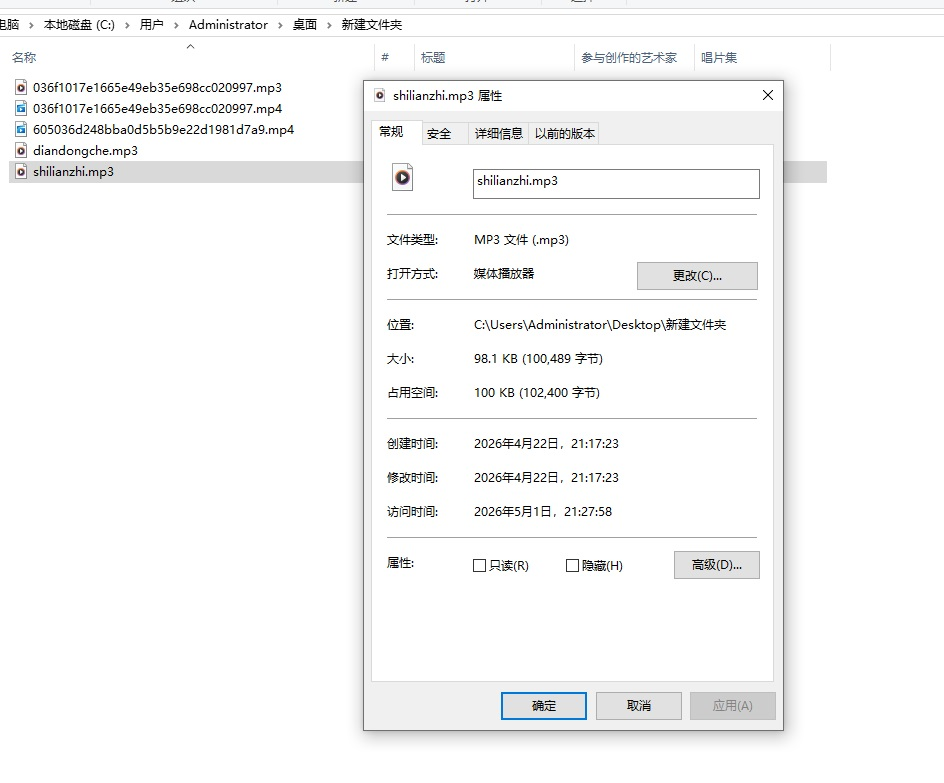
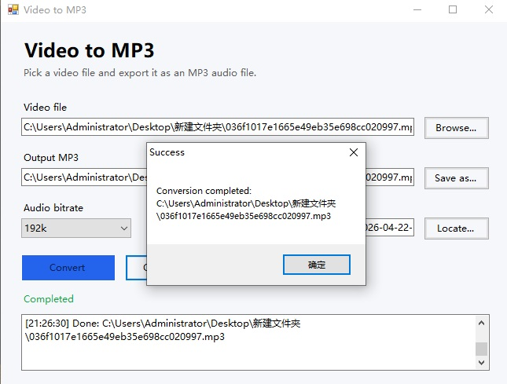
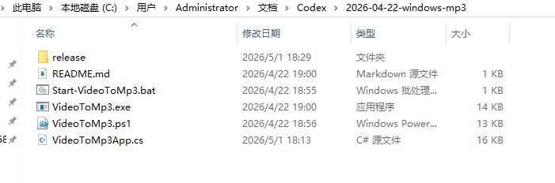
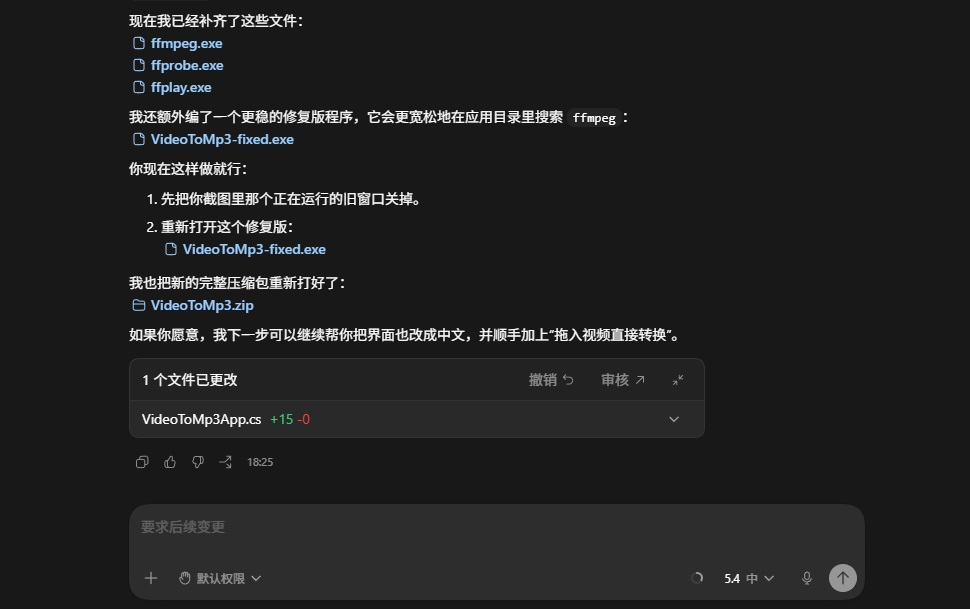

# codex-video-to-mp3

A Windows desktop app for extracting MP3 audio from video files, created with AI assistance.

一个利用人工智能辅助开发的 Windows 桌面应用程序，用于从视频文件中提取 MP3 音频。

## Project Overview

This project is a lightweight Windows desktop app that converts video files into MP3 audio files.
It was created with AI coding assistance and used in a real local workflow.

这个项目是一个轻量级 Windows 桌面应用，可将视频文件提取为 MP3 音频。
项目借助 AI 编码工具完成开发，并已在本地真实使用。

## Main Features

- Select a local video file
- Export audio as MP3
- Support bitrate selection
- Use FFmpeg for audio extraction
- Simple Windows GUI for local use

- 选择本地视频文件
- 导出为 MP3 音频
- 支持码率选择
- 使用 FFmpeg 进行音频提取
- 提供简单的 Windows 图形界面

## AI-assisted Development

This project was developed with AI assistance in the following steps:

- Requirement drafting
- App structure design
- GUI generation
- FFmpeg integration
- Packaging and release preparation
- README and usage documentation

本项目在以下环节使用了 AI 辅助开发：

- 需求梳理
- 应用结构设计
- 图形界面生成
- FFmpeg 集成
- 打包与发布整理
- README 与使用说明整理

## Usage

1. Open the app
2. Select a video file
3. Choose output MP3 path
4. Confirm FFmpeg path if needed
5. Click Convert

1. 打开程序
2. 选择视频文件
3. 选择输出 MP3 路径
4. 如有需要，指定 FFmpeg 路径
5. 点击 Convert 开始转换

## Current Status

The application has been generated, opened successfully on Windows, and used to extract MP3 audio from local video files.

该应用已经生成完成，可在 Windows 上成功打开，并已用于从本地视频文件中提取 MP3 音频。

## Screenshots

### App running on Windows

### MP3 output proof

### Project structure

### AI-assisted build result

